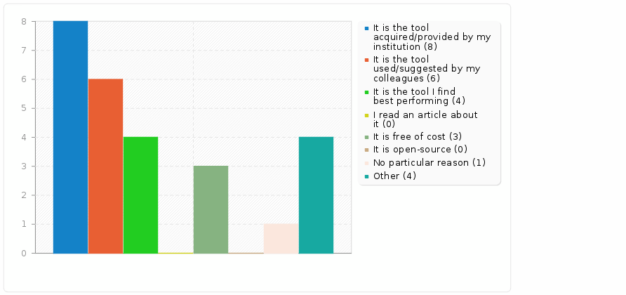
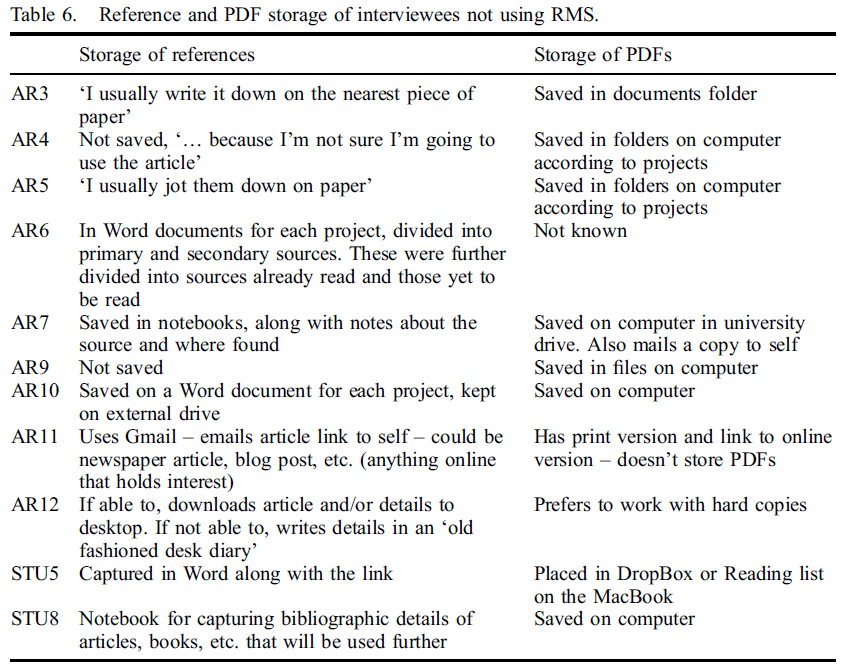

# Bibliographic and PDF management tools : overview and practical focus on Zotero

 Ce document est mis à disposition selon les termes de la <a rel="license" href="http://creativecommons.org/licenses/by-sa/3.0/fr/">Licence Creative Commons Attribution -  Partage dans les Mêmes Conditions 3.0 France</a>.

# Part 1 : Exchanges - 1h
## Sequence 1 : Introduction to RMS

* What is an RMS and how to choose one ?

### Key question 1 : How do authors handle bibliographic management  ?
#### What reference management software (RMS) or system do you currently use?

_Live question using Slido or Pingo or any other live poll service - multiple choice answer_

- [ ] EndNote
- [ ] EndNote Web
- [ ] BibDesk
- [ ] JabRef
- [ ] BibTeX
- [ ] Zotero
- [ ] Papers
- [ ] Mendeley
- [ ] ReferenceManager
- [ ] I don't use any RMS, please specify how your manage your references
- [ ] Other, please specify

#### How do CEE authors handle bibliographic management ?

Online survey ongoing - questionnaire sent by email on 2018-02-08 to corresponding authors of articles published in _Environmental Evidence_ between 2013 and 2017.

The questionnaire is available as a PDF file from [here](https://osf.io/bvp34).

**11 submissions** are recorded ; submissions re still expected at : https://huit.re/CEE_biblio_management_survey

* **CEE authors : survey : main preliminary findings**

**EndNote** is the leader with 9 users - 2 comments : use of free softwares for projects with collaborators from non-suscribing institutions.

2 main criteria of choice : **provided by institution** and **recommandation** by a colleague.

* **CEE authors : report of use in the articles : to be performed**

Shall we expect a discrepancy between use and report of use?

> Of the 78 researchers who responded to our survey, 79.5% reported that they had used a reference management software package to prepare their review. Of these, 4.8% reported this usage in their published studies. EndNote, Reference Manager, and RefWorks were the programs of choice for more than 98% of authors who used this software.

Lorenzetti, D. L. & Ghali, W. A. (2013). Reference management software for systematic reviews and meta-analyses: an exploration of usage and usability. _BMC Medical Research Methodology_, _13_, 141. https://doi.org/10.1186/1471-2288-13-141

Does it matter ?

> In the context of systematic reviews, reference management programs facilitate the capture and organization of studies identified through electronic database searching, the identification and elimination of duplicate records from multiple database searches, the transfer of references to Cochrane RevMan and other systematic reviews software, and the accurate citing of references within manuscripts. Thus, an author’s decision to use, or not use, this software may impact on the accurate reporting of the number of studies reviewed for inclusion and exclusion in a systematic review.

Lorenzetti, D. L. & Ghali, W. A. (2013). Reference management software for systematic reviews and meta-analyses: an exploration of usage and usability. _BMC Medical Research Methodology_, _13_, 141. https://doi.org/10.1186/1471-2288-13-141

####  How do other authors handle bibliographic management ? A brief overview of some existing surveys : 1. Univ. of Illinois

Emanuel, J. (2013). Users and citation management tools: Use and support. _Reference Services Review_, _41_(4), 639‑659. https://doi.org/10.1108/RSR-02-2013-0007

##### Methodology / coverage
Online questionnaire distributed to 5000 "serious researchers" in January and February **2012**,

**178** valid responses,

of which **20%**  from agriculture and environmental/life sciences  ; the majority of submissions were from liberal arts and social sciences.

##### Findings

**EndNote** = the most used tool, with 65 users.

"Core functionalities" of RMS are promoted.

> The ability to support multiple data types does not appear to be a factor for users, as only 11 percent stated that the ability to have web pages as an import source was important and only 3 percent needed support for other formats including data sets and multimedia files.

Role of others as an important factor of choice.
<small>
>Another aspect addressed by survey questions was the role others played tool selection. The data show that others do influence use, with 34 percent citing that if colleagues in a research group, class, or course used a specific tool, they were more likely to use it. Recommendation by a colleague is a factor for 32 percent and a librarian recommendation is only a factor for 11 percent.
</small>

####   How do other authors handle bibliographic management ? A brief overview of some existing surveys : 2. Monash Univ.

Melles, A. & Unsworth, K. (2015). Examining the Reference Management Practices of Humanities and Social Science Postgraduate Students and Academics. _Australian Academic & Research Libraries_, _46_(4), 249‑274. https://doi.org/10.1080/00048623.2015.1104790

##### Methodology / coverage

* Online questionnaire sent to 800 postgraduate Arts students in November and December **2013**, **81** submissions
* Interviews : 21 people volunteered to participate in the interview, held between December 2013 and February 2014

##### Findings

Similar findings : core functionalities promoted and importance of others in the criteria of choice.

Interesting point : this survey takes into account the methods and tools of people not using RMS (table 6 below).

_Table 6 from (Melles & Unsworth, 2015)_

####   How do other authors handle bibliographic management ? A brief overview of some existing surveys : 3. Univ. of Torino

We built our survey on this questionnaire, we ought to mention this study.

Francese, E. (2012). _Reference Management Software as Digital Libraries: a survey at the University of Torino_. Master thesis : International Master in Digital Library Learning. Høgskolen i Oslo, Oslo. Repéré à http://hdl.handle.net/10642/1274

##### Methodology / coverage

* Online questionnaire sent to 1031 professors, researchers and PhD students from the STM departments between March and May **2011**, **187** submissions
* Interviews : 13 people volunteered to participate in the interviews

##### Findings

EndNote the leader (49%)

The two most frequently cited reasons for the use of the software :
* a suggestion by colleagues (41%),
* tool provided by the University (33%).

### Key question 2 : What is an RMS and how to choose one ?

What is an RMS : a new definition?

Tramullas, J., Sanchez-Casabon, A. I., & Garrido-Picazo, P. (2015). Studies and Analysis of Reference Management Software: A Literature Review. _Profesional De La Informacion_, _24_(5), 680‑688. https://doi.org/10.3145/epi.2015.sep.17

>Reference management software can no longer be defined in the traditional sense provided by the reviewed literature. Currently, it is an integrated tool of information management providing support to workflows of scientific research in any given area.

#### Existing services/softwares
Let's have a look at the comparison chart reproduced below, from [*Up to speed with Zotero*](https://github.com/epfllibrary/zotero-course) by EPFL librarians.

|  |  |  |  |  |
| :----: | :-----: | :------: | :------: | :----: |
| BibTeX | EndNote | Mendeley | ReadCube | Zotero |
| free license | owned by Clarivate Analytics | owned by Elsevier | owned by Digital Science &amp; Research Solutions, Inc. | free license |
| free of charge | $249.95 | free of charge | $55/year | free of charge |
|  |  |  |  |  |
| integrated with   LaTeX | integrated with Word OpenOffice (LaTeX) | integrated with Word OpenOffice (LaTeX) | integrated with Word OpenOffice (LaTeX) | integrated with Word OpenOffice LaTeX |
| 8,900+ citation styles | 6,000+ citation styles | 8,900+ citation styles | 8,900+ citation styles | 8,900+ citation styles |

#### Criteria to look at when choosing RMS : features
Usability and efficiency for the following. Using different tools for basic/extra features?

##### Basic features = related to managing citations
* Saving references, organizing references (including **deduplication**), citing references - important : compatibility with your **writing tools** (_e. g._ simple workflow if you work with LaTeX for example).
* Import/export and compatibility with **standard bibliographic formats** : RIS, BibTeX, and other useful formats : **.csv**.
* **Interoperability** : the more standard and interoperable, the easier it is to work with **different softwares** (at the same time or when migrating from one tool to another one) and with **different people**.

##### Extra features if applicable
* Managing **PDF** (and other files) as well as references (but is this extra or basic?).
* Handling different **types of material** beyond literature items (webpages, images, and eveything you may use as documentation).
* **Sharing** and collaboration features.

##### Other criteria : reliability when citing references ?

Kratochvíl, J. (2017). Comparison of the Accuracy of Bibliographical References Generated for Medical Citation Styles by EndNote, Mendeley, RefWorks and Zotero. _The Journal of Academic Librarianship_, _43_(1), 57‑66. https://doi.org/10.1016/j.acalib.2016.09.001

Accurate citations depend mainly on 2 factors of quality.
* **Bibliographic data** : the ability of the software to save high quality of metadata is one point, the other is you : do not forget to save references from reliable bibliographic sources and to check and upgrade your references, so that they are accurate and complete.
* **Bibliographic style** : the ability of the style to follow the requirements of the journal (or other source of requirements). Zotero styles are written in [CSL  - Citation Style Language](http://citationstyles.org/) also used by Mendeley, Pandoc, etc. = a large community to update the repository of styles.

##### Other criteria : open source

**1. Open source 1/3 : user and his needs at the center**

Cahoy, E. (2018). Leave the browser behind: Placing discovery within the user’s workflow. _LIBER Quarterly_, _28_(1). https://doi.org/10.18352/lq.10221
2 new major features developped recenly for Zotero to take into account users' needs:

* RSS feeds : to address "issues with the disconnected nature of discovery in relation to citation management software"
* *My publications* :  "is intended to be populated with the user’s authored works" - code available to connect an institutionnal repository with *My publications*

A key (for us) finding of this survey

> It seemed that perhaps the biggest user barrier was in learning how to use and integrate citation management software into one’s workflow.

**2. Open source 2/3 : a community of users... and developers**

Examples : plugin adding great features, developped by users

* [ZotFile](http://zotfile.com/) : one of the best plugin to improve attached files management
* [Zutilo](https://github.com/willsALMANJ/Zutilo) : many utilities to help managing tags by batch, copying items to the clipboard in many different formats, and more
* [BetterBib(La)Tex](https://retorque.re/zotero-better-bibtex/) : THE plugin for LaTeX users

**3. Open source 3/3 : an ethos choice**

Perkel, J. M. (2015). Eight ways to clean a digital library. _Nature News_, _527_(7576), 123. https://doi.org/10.1038/527123a

> Richard Karnesky, a materials scientist at the Sandia National Laboratories in Livermore, California, supports Zotero for its open-source ethos, for example.

This article also reports a case of use in systematic review.

> Brenton Wiernik, an organizational psychology PhD candidate at the University of Minnesota in Minneapolis, uses a shared library in Zotero for collaborative projects involving systematic reviews and meta-analyses of the literature in his field.

NB B. Wiernik is very active for Zotero, has developed several features (plugins, citation styles, etc.), see the [Software page on his personal website](https://wiernik.org/software).

We also would like to highlght this comment from B. Wiernik on using Zotero for systematic reviews - [comment on Zotero forum in 2014](https://forums.zotero.org/discussion/comment/206248/#Comment_206248).

> Most of my research is systematic reviews and meta-analyses, and I certainly find that Zotero is extraordinarily helpful in this area. I've used both Endnote and Zotero for meta-analyses and find Zotero to be easier overall, due to the tight integration with all of the various databases adamsmith mentions. I don't tend to rely on automated searches for the reviews I do, so I never found EndNote's Z39.50 functionality terribly useful.

>The other major advantage is the flexibility that tags, collections, saved searches, etc. offer. Rather than specifying a certain organization scheme, these features allow me to adapt the structure and organization of my saved studies to fit the needs of the current project. Exactly how I need to classify and code each study varies a lot across substantive domains, and the flexibility that Zotero offers here has been very helpful.

>The group library and collaboration functions have also been a major advantage. I usually have teams of 10-20 research assistants working a review with me, and shared group libraries have helped me facilitate tasks like assigning articles to review to different RAs and making appropriate materials available to my RAs while limiting their write capabilities.

### Conclusions for sequence 1

Perkel, J. M. (2015). Eight ways to clean a digital library. _Nature News_, _527_(7576), 123. https://doi.org/10.1038/527123a

> Perhaps the best reason for using a reference manager is the technology’s ability to provide a form of searchable memory.
>....
> With a digital reference manager, however, buried knowledge is just a keyword search away.

Rempel, H. G. & Mellinger, M. (2015). Bibliographic Management Tool Adoption and Use A Qualitative Research Study Using the UTAUT Model. _Reference & User Services Quarterly_, _54_(4), 43‑53. https://doi.org/10.5860/rusq.54n4.43

> Saving time on tasks like bibliographic management has the potential to allow researchers to be more efficient in their work, and as a result, spend more time on other aspects of the research process.

## Sequence 2 : RMS features

**Key questions**

* How can RMS features meet with your needs and fit into your workflows?
* What RMS features might be particularly valuable and useful for systematic reviews?
* More generally, how can you save time thanks to RMS? As RMS will perform automatic and stupid tasks, you will be able to focus on the tasks that really need your brain.

Cahoy, E. (2018). Leave the browser behind: Placing discovery within the user’s workflow. _LIBER Quarterly_, _28_(1). https://doi.org/10.18352/lq.10221
> It seemed that perhaps the biggest user barrier was in learning how to use and integrate citation management software into one’s workflow.

We will first have a first overview of what RMS can do, so that you can better address what you would like to do using RMS.

### What tasks do you expect an RMS should perform?

_Live question using Slido or Pingo or any other live poll service - multiple choice answer_
- [ ] Saving references
- [ ] Adding and editing citations and bibliography into the paper you are writing
- [ ] Organizing references for easier retrieval and management
- [ ] Deduplicating references
- [ ] Automatic retrieval of full text pdf files
- [ ] Storing pdf files of research papers
- [ ] Sharing references with colleagues
- [ ] Creating lists of references
- [ ] Exporting references in files (csv for example)
- [ ] Appraising search results and coding references for inclusion in or exclusion from a systematic review
- [ ] Other

### CEE authors survey
Same items, but slightly different question

> How would you assess the **usability** of your RMS for the following features, on a scale from 1 to 5 ? Please answer regardless of the software if you use several different softwares at the same time. _1 = I am very dissatisfied with the usability of my RMS for this feature. 5 = I am very satisfied with the usability of my RMS for this feature._

`+` question about other tools used /mentionned : EPPI Reviewer, Covidence, NoteExpress (Chinese references), Excel

#### Findings

Satisfaction with traditional tasks performed by RMS :thumbsup:
* _Saving references_ : **78%** 4-5
* _Adding and editing citations and bibliography into the paper you are writing_ : **64%** 4-5

Less satisfaction and/or mixed feelings with extra features :thumbsdown:

* _Sharing references with colleagues_ : **60%** 1-3
* _Appraising search results and coding references for inclusion in or exclusion from a systematic review_ : **20%** no answer - among answers : **89%** 1-3

### Key bibliographic tasks to perform for a systematic review (beyond bibliographic management)
* Screening/coding
* Deduplicating
* Extra

  * identifying articles with missing abstracts - [how-to with Zotero](https://forums.zotero.org/discussion/comment/252769/#Comment_252769)
  * documenting literature search - [how-to with Zotero in French](https://tribuneci.wordpress.com/2016/10/11/zotlog-structurer-son-parcours-de-recherche-avec-zotero/)
  * sharing (including PDF) - [how-to with Zotero in French](https://github.com/fflamerie/zotero_collaborative)
  * updating

* Examples from the literature

We will highlight some features of Zotero in relation with _Screening/coding_ and _Deduplicating_.

#### Screening/coding
_See below for examples from the literature_

Zotero specific feature to highlight in relation with this task : **reports**. It is detailed in lenght and images in this page : Wiernik, B. (n.d.). Reports [Zotero Documentation]. _Zotero_. Available at https://www.zotero.org/support/reports

> **Reviewing Abstracts**
>
>If you need to review a large number of papers' titles, authors, and abstracts (e.g., if you are conducting a systematic review using Zotero), reports can provide a convenient layout for reading the abstracts and writing notes in the margins.

####  Deduplicating
_See below for examples from the literature._

Deduplication is not yet supported by CADIMA.

See : Kohl, C., McIntosh, E. J., Unger, S., Haddaway, N. R., Kecke, S., Schiemann, J., & Wilhelm, R. (2018). Online tools supporting the conduct and reporting of systematic reviews and systematic maps: a case study on CADIMA and review of existing tools. _Environmental Evidence_, _7_, 8. https://doi.org/10.1186/s13750-018-0115-5

**Deduplicating with Zotero?**

Zotero does note provide **batch deduplication**, wich makes the process longer, but avoid false positives.

##### Keeping track of deduplicated items in Zotero : a discussion on the forum
* [Valuable comment 1](https://forums.zotero.org/discussion/comment/254031/#Comment_254031) by bwiernik - May 18, 2016

>I think you probably have a few more steps than needed. I would recommend this:
>1. Your first step--save the results for each search in a separate collection.
>2. Open the duplicate items view and merge duplicates. Important--do not delete items, merge them.
>3. After merging duplicates, the main library view (across collections) will show you the final list/number of unique items.
>4. To get the total number of original items, including duplicates, open each database collection and sum up the number of items in each. Because you merged, not deleted, duplicates, each duplicate will still be present in each of its original source folders.-->

_Note : Tags might be used as well as collections. Tags make part of the bibliographic records and are exported as metadata  ; using tags, it is thus possible to keep track of the whole process and of all the steps in further analysis. Tags will be exported as keywords and be recorded in .bib, .csv, etc. exports._

* [Valuable comment 2](https://forums.zotero.org/discussion/comment/254043/#Comment_254043) by bwiernik - May 18, 2016
>For your first point, I recommend that you create a new Zotero Group for each systematic review you conduct. This way, each review can have unique library that is separate from any other project you do. I do this for each of my reviews, and it is really helpful for keeping everything neatly separated. This is even helpful if you are the only member of the group.
>
>With regard to maintaining the original metadata, I think there are differences in reporting traditions across fields here. In psychology, analyses regarding the quality of metadata in different databases aren't common, and it is considered sufficient to document the number of studies that came from each database as well as which studies came from which database (retaining the original poor quality metadata is not considered necessary--in my particular field this is especially the case because many sources are not indexed by any database, such as test publisher internal data).
>
>Given that your reporting needs are greater, I see that merging will not necessarily work for you. I have a few thoughts on how you might streamline your workflow if they meet your needs.
>
>1 - Do you need to have the original raw metadata constantly available in Zotero? If not, it might work for you to export the untouched results from each database collection and simply archive them for later use if necessary (I believe that Zotero RDF will be the least lossy export format, @adamsmith please correct me if I'm wrong.) Then, you can proceed with the merge duplicates workflow I describe above.
>
>2 - If you really do need to have the untouched items readily available in Zotero, I would recommend you import each database into its own collection, then, in the main Group library view, sort by Title then Author (or some other pair of variables that will put the duplicates next to each other. Then, for each set of duplicate articles, you can choose the one with the best metadata, Duplicate it and correct the metadata, then apply a tag to indicate that this corrected item is the master item of the set (you can set this tag to be one of the library's colored tags to give you a visual indicator of its status). For items that are not duplicates, you could just add the colored tag if not metadata corrections need to be made. To keep track of the duplicate item sets, you can select them all together in the main library view and then use the Zutilo function to relate them all together (this way, you can hop between different versions of the item quickly--you can also add a tag to each item in the database collections so you can quickly see which database each version came from).
>
>3 - One other alternative would be to create another Group library for the review. After you import all of the items, rather than exporting to Zotero RDF, you can go to the main library view, select all the items, then drag them to the other library, where you can do all the merging and further analyses. This isn't as flexible with regard to being able to compare the raw versions to the merged corrected version, but it would keep your libraries less cluttered.-->

#### Examples from the literature : systematic review specific : coding

* **Example 1** : can be adapted for Zotero ; it would be helpful to check if "creation of mutually-exclusive Groups within Group Sets" might be achieved by a saved search in Zotero.

Peters, M. D. J. (2017). Managing and Coding References for Systematic Reviews and Scoping Reviews in EndNote. _Medical Reference Services Quarterly_, _36_(1), 19‑31. https://doi.org/10.1080/02763869.2017.1259891

* **Example 2** :  can be adapted for Zotero ; new fields can not be created in Zotero, but the `Extra` field or tags might be used for reviewer's name.

Bramer, W. M., Milic, J., &amp; Mast, F. (2017). Reviewing retrieved references for inclusion in systematic reviews using EndNote. _Journal of the Medical Library Association_, _105_(1), 84‑87. https://doi.org/10.5195/jmla.2017.111

* **Example 3** :  can be adapted for Zotero : collections + saved searches

King, R., Hooper, B., & Wood, W. (2011). Using bibliographic software to appraise and code data in educational systematic review research. _Medical Teacher_, _33_(9), 719‑723. https://doi.org/10.3109/0142159X.2011.558138

#### Examples from the literature : systematic review specific : deduplicating

Cannot be adapted for Zotero ; see above for deduplicating with Zotero.

Bramer, W. M., Giustini, D., Jonge, G. B. de, Holland, L., & Bekhuis, T. (2016). De-duplication of database search results for systematic reviews in EndNote. _Journal of the Medical Library Association_, _104_(3), 240‑242. https://doi.org/10.5195/jmla.2016.24

#### Example from the literature : systematic review specific : updating

Cannot be adapted for Zotero as such, as Zotero does not batch deduplicate, does not allow customized deduplication rules and merges the duplicates.

Bramer, W. & Bain, P. (2017). Updating search strategies for systematic reviews using EndNote. _Journal of the Medical Library Association_, _105_(3), 285‑289. https://doi.org/10.5195/jmla.2017.183

#### Example from the literature : solving the "tracking issue?"
as described in

Al-Anazi, M., Hinze, A., Vanderschantz, N., Timpany, C., & Cunningham, S. J. (2014). Personal Digital Libraries: Keeping Track of Academic Reading Material. In _The Emergence of Digital Libraries – Research and Practices_ (pp. 39‑47). Springer, Cham. https://doi.org/10.1007/978-3-319-12823-8_5

Possible with Zotero without any other third-party tool, combining tags, notes, saved searches and eventually collections.

## Sequence 3 : your needs - agenda for the training part

* What are your expectations for the 2 next hours?
* How can we draft an agenda that meeets these expectations?

---
### Key question 1 : what do you expect to learn today?
_Live question using Slido or Pingo or any other live poll service - free text answer_

### Agenda

**Initial draft**

* [10 min] how to get stuff into Zotero
* [15 min] tips and tricks how to keep a cleaned-up library
* [10 min] collections/tags/saved searches to organize the library
* [20 min] file management with Zotfile
* **[5 minutes questions] = 1hour**
* [20 min] groups to share bibliography
* [10 min] bibliographic writing : plug-in Word + goodies
* [20 min] exports : including csv and [customization of csv exports](https://forums.zotero.org/discussion/41927/export-collection-in-csv-format-how-to-get-rid-of-superfluous-columns)
* **[10 minutes questions] = 1hour**

# Part 2 : training and working - 2h
_The content was intended to be produced during and after the workshop._
